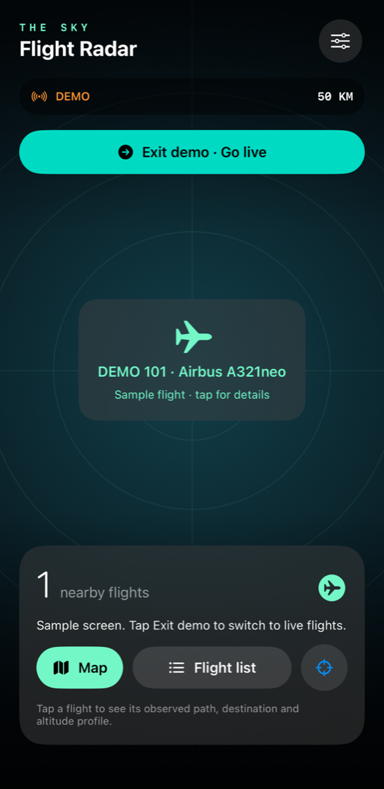
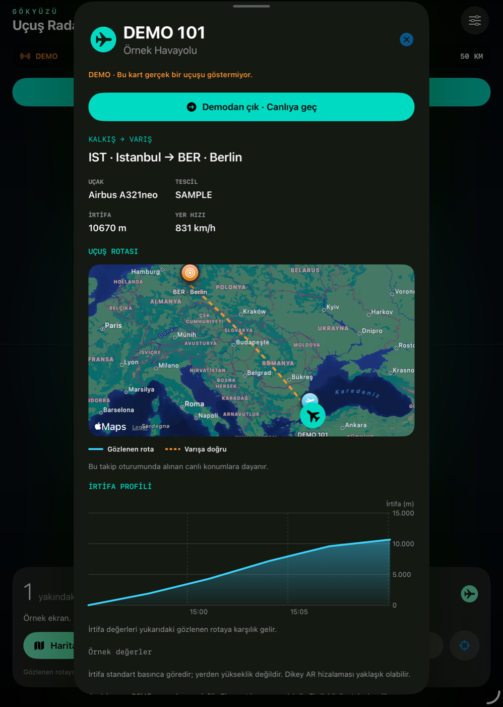

# Flight Radar

A privacy-conscious SwiftUI and ARKit flight tracker for iPhone and iPad. Point the camera at the sky, explore nearby aircraft, and inspect an observed route, destination and altitude profile.

<p align="center">
  
  &nbsp;&nbsp;
  
</p>

## Highlights

- Camera-based aircraft labels aligned with ARKit and true north.
- Nearby-flight list and interactive MapKit route view.
- Flight detail screen with aircraft data, destination marker and altitude chart.
- Observed path built from positions received during the current tracking session.
- English and Turkish interface selectable in the app without restarting.
- Free live data mode with no account or API key.
- Optional Flightradar24 API support for users with their own paid API access.
- No analytics, advertising SDK or bundled credentials.

## Requirements

- iOS or iPadOS 17.0+
- Xcode 16 or later
- A physical device for camera/AR testing
- Precise Location and Camera permissions

The project uses only Apple frameworks and has no external package dependencies.

## Getting started

1. Clone the repository and open `PlaneTracker.xcodeproj`.
2. Select the `PlaneTracker` target.
3. Under **Signing & Capabilities**, choose your Apple development team.
4. Replace `com.example.PlaneTracker` with a bundle identifier registered to your team.
5. Choose a connected iPhone or iPad and press **Run**.

Run the core checks from Terminal:

```sh
zsh scripts/test.sh
```

Install on a connected device from Terminal:

```sh
zsh scripts/install.sh IOS_DEVICE_IDENTIFIER
```

The install script uses Xcode automatic signing, installs the generated app and reads its final bundle identifier before launching it. Development profiles expire and require the app to be rebuilt and installed again.

## How flight paths work

The cyan path contains real position samples received while the app is actively tracking that flight. If the selected provider does not supply earlier history, the app does not invent it. The altitude chart uses the same time-ordered samples.

The orange dashed line is a geographic connection from the aircraft's current position to the destination airport. It is not a guaranteed flight plan or predicted route.

Community airport, airline and aircraft metadata may be missing, stale or incorrect when callsigns are reused. The interface labels community data and leaves unavailable values unknown.

## Data sources

### Free mode

**Automatic · free** tries these providers in order and falls back when a provider fails or reaches its limit:

1. [OpenSky Network](https://openskynetwork.github.io/opensky-api/rest.html)
2. [ADSB.lol](https://www.adsb.lol/docs/open-data/api/)
3. [adsb.fi](https://adsb.fi)

[adsbdb](https://www.adsbdb.com) may provide community-maintained airport, airline and aircraft metadata when a flight is selected.

Review each provider's terms before distributing or commercially operating the app. In particular, see the [ADSB.lol license](https://www.adsb.lol/privacy-license/) and [adsb.fi usage terms](https://github.com/adsbfi/opendata).

### Optional paid mode

The Flightradar24 integration requires a separate API plan and the user's own API key. A consumer app subscription may not include API access. Requests can consume paid credits.

The key is entered in Settings and stored in the device Keychain with `WhenUnlockedThisDeviceOnly`. No provider key or shared secret is included in this repository. A production service should keep shared paid-provider credentials behind a backend rather than inside the app.

## Privacy and security

- Camera frames are processed locally and are not recorded or uploaded.
- The approximate search area is sent to the selected live-position provider.
- A selected aircraft identifier or callsign may be sent to adsbdb for metadata lookup.
- The app contains no analytics, advertising, user account or telemetry integration.
- API credentials are not logged or committed to source control.
- `.env`, provisioning profiles, Xcode user data, build output and archives are ignored by Git.

The included screenshots were captured in Apple simulators using sample data. They contain no real flight, user account, device name, photo, notification, location or credential.

## Project structure

```text
PlaneTracker/
  Flight.swift          Flight model, decoding and geometry
  FlightService.swift   Provider requests, metadata and Keychain storage
  TrackerModel.swift    App state, refresh loop and observed route history
  SkyCamera.swift       AR camera overlay
  RouteMapView.swift    Map route and altitude profile
  PlaneTrackerApp.swift SwiftUI screens and bilingual interface
Tests/
  main.swift            Dependency-free core checks
scripts/
  install.sh            Physical-device build and install helper
  make-icon.swift       App icon generator
  test.sh               Core test runner
```

## Verification and limitations

See [VERIFICATION.md](VERIFICATION.md) for the latest build and simulator checks.

AR alignment depends on GPS altitude, compass accuracy, sensor calibration and aircraft data freshness. Coverage is incomplete. This project is for exploration and education only and must not be used for navigation or operational decisions.

## License

No license has been selected yet. Public visibility allows people to read and fork the repository, but does not grant permission to reuse or redistribute the code. Add an appropriate license before inviting reuse or contributions.
